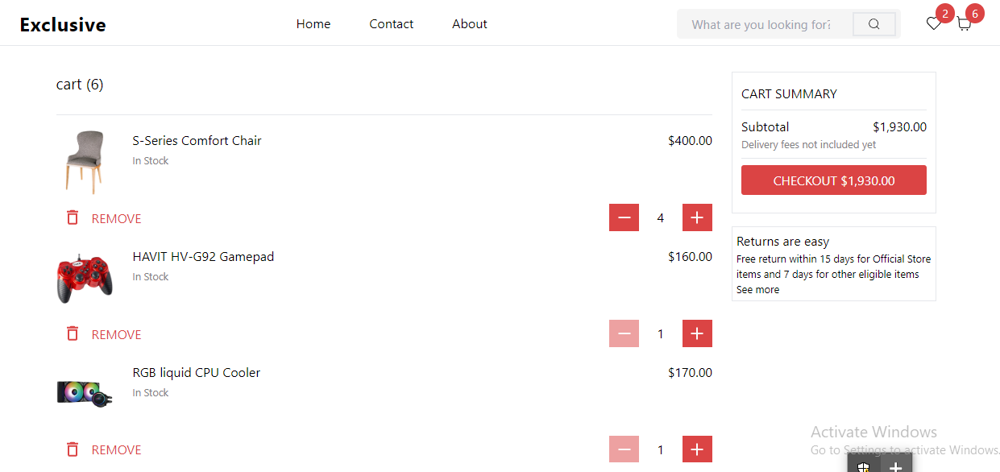
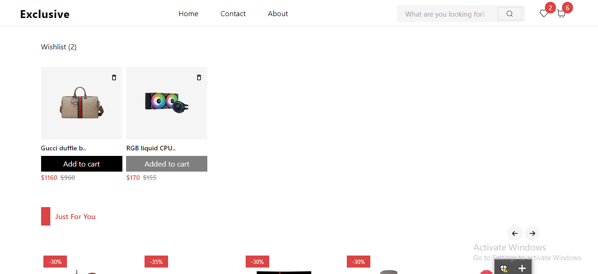
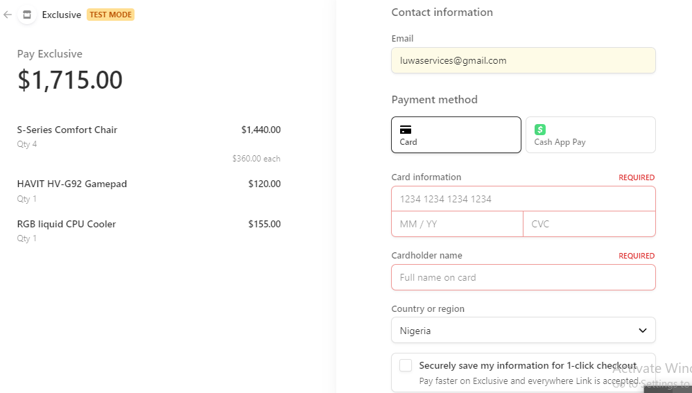
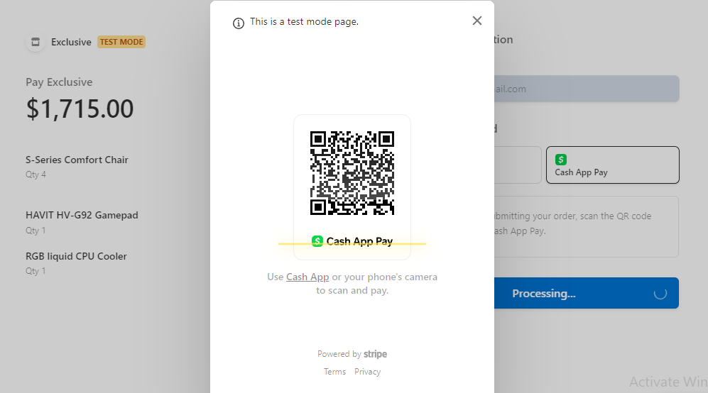

> Live demo [_here_](https://exclusive-ecommerce-app.netlify.app).

## Table of Contents
* [General Info](#general-information)
* [Technologies Used](#technologies-used)
* [Features](#features)
* [Screenshots](#screenshots)
* [Usage](#usage)
* [Room for Improvement](#room-for-improvement)

## General Information
- Exclusive is an e-commerce web application designed to offer users a seamless shopping experience.
- The application aims to provide essential e-commerce functionalities such as user authentication, product search, cart, and wishlist management.
- The project was undertaken to explore the integration of modern web technologies and third-party services like Stripe and Auth0 for creating a robust e-commerce solution.

## Technologies Used
- React JS
- TailwindCSS
- Typescript
- Node JS
- Express JS
- MongoDB
- Stripe
- Auth0

## Features
List of ready features:
- Authentication with auth0
- Search functionality
- Cart and Wishlist functionality
- Stripe test API integration

## Screenshots

## Usage
To use the application, follow these steps:

1. Navigate to the [live site](https://exclusive-ecommerce-app.netlify.app).
2. Log in using the test email and password:
   - Email: `test@gmail.com`
   - Password: `ExclusiveTest@1`
3. Browse products, add items to your cart or wishlist.
4. When checking out, use the following test card information:
   - Card number: `4242 4242 4242 4242`
   - Card expiration date: any future date
   - Card CVC: any three-digit number

## Room for Improvement
Areas for improvement:
- Search functionality
- Product details page

To do:
- Implement user profile management
- Implement async autocomplete search, for a better user experience and better efficiency and robustness
- Disable add to cart functionality in product details page when user is not authenticated.